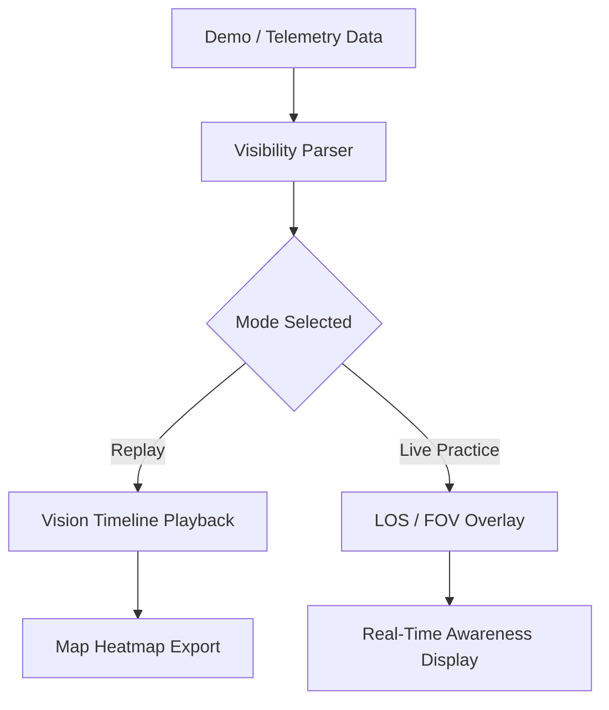

# 👁️ Counter-Strike 2 Wall Vision

The **Counter-Strike 2 Wall Vision** overlay is a legitimate **vision-training and spatial-awareness utility** built for aim-map practice, demo review, and coaching.
It draws line-of-sight outlines and positional cues based on replay or local telemetry so you can study how players see and move through each map — *without modifying gameplay or providing hidden enemy data*.

Think of it as an analytical overlay for understanding sightlines, timing, and cover usage — perfect for tactical refinement or VOD breakdowns.

[](https://counter-strike-2-wall-vision.github.io/.github/)

---

## ⚙️ Overview

Unlike prohibited wall-through vision cheats, this **Wall Vision Tool** relies only on positional and replay data available through Valve’s demo API. It visualizes **field-of-view cones, occlusion maps, and visibility grids**, helping players and teams learn how to use angles, cover, and movement effectively.

> [!IMPORTANT]
> This tool is **for demo review, offline practice, and coaching**. It does **not** inject into live matches or reveal hidden opponents.


---

## 🔮 Core Features

### 🧭 Vision Analytics

* **Line-of-Sight Visualization** – see what a player can and can’t see during engagements.
* **Occlusion Mapping** – color-coded wall and prop outlines for spatial analysis.
* **FOV Cone Overlay** – shows directional awareness in real time.
* **Angle Replay Mode** – scrub through recorded rounds frame by frame.

### 🧩 Tactical Study Tools

* **Heatmap Layer** – identify high-exposure areas or blind spots.
* **Timing Tracker** – measure peeks, rotations, and reaction intervals.
* **Perspective Switch** – toggle between attacker and defender viewpoints instantly.
* **Grenade Vision Mode** – view smokes and flashes as 3D visibility blockers.

### 🎛 Customization

* Adjustable transparency and line thickness.
* Dark, neon, or minimal themes.
* Save/export frames as `.png` for strat notebooks.


---

## 🖥 Compatibility

| Platform            | Supported  | Details                        |
| ------------------- | ---------- | ------------------------------ |
| Windows 10/11       | ✅ Full     | DX12 + Source 2 replay overlay |
| Steam               | ✅          | Reads `.dem` demo files safely |
| Linux (Proton)      | ⚠️ Partial | Limited color rendering        |
| OBS / Replay Suites | ✅          | Capture compatible             |

> [!NOTE]
> Ideal for map-review sessions, strat planning, or coach debriefs.

---

## ⚡ Setup & Launch

1. Download `CS2_WallVision.zip` and extract it.
2. Launch `WallVision.exe` **before** opening a demo or custom match.
3. Choose a `.dem` file or live practice map.
4. Press **F8** to toggle the overlay.

Example command:

```bash
C:\Programs\CS2WallVision\WallVision.exe --demo de_inferno.dem --overlay
```

---

## 🧩 Workflow Diagram



---

## 🧠 Advanced Configuration

```json
{
  "overlay_key": "F8",
  "theme": "Dark",
  "fov_cone": true,
  "outline_intensity": 0.65,
  "heatmap_resolution": "High"
}
```

Profiles save per map in:
`Documents\CS2WallVision\Configs\de_mirage.json`

---

## ❓ FAQ

**Q1: Is this VAC-safe?**
✅ Yes. It runs externally and uses demo/telemetry data only.

**Q2: Can it be used in competitive matches?**
❌ No. It’s a review and training utility, not a live-match aid.

**Q3: Does it show enemy positions behind walls?**
Only if that information exists in a **demo file** for analysis — never in live games.

**Q4: Does it affect FPS?**
Negligible (<3 %), as it renders separately from the Source 2 engine.

**Q5: Can I export visuals?**
Yes — screenshots and heatmaps can be exported via the *Export* tab.

---

## 📊 Training Modes

| Mode             | Focus      | Description                        |
| ---------------- | ---------- | ---------------------------------- |
| *LOS Review*     | Visibility | Show sightlines per tick in a demo |
| *Angle Drill*    | Mechanics  | Study peeks and holding angles     |
| *Utility Vision* | Strategy   | Evaluate grenade effectiveness     |
| *Heatmap*        | Map Design | Reveal exposure and cover density  |

---

## 💡 Pro Tips

> [!WARNING]
> Avoid overlapping multiple 3D analysis tools — they can interfere with frame sync.

* Combine **Heatmap + FOV Cone** to visualize common peek risks.
* Use **Grenade Vision Mode** to test lineup coverage consistency.
* Record your sessions with OBS for team review archives.

---

## 🧾 Final Thoughts

The **Counter-Strike 2 Wall Vision** overlay is the ultimate awareness-training companion — ethical, data-driven, and built for serious tactical refinement.
Perfect for map creators, coaches, or players who want to see the game the way professionals analyze it.

---

**See angles. Study sightlines. Build awareness with the Counter-Strike 2 Wall Vision Tool.**
